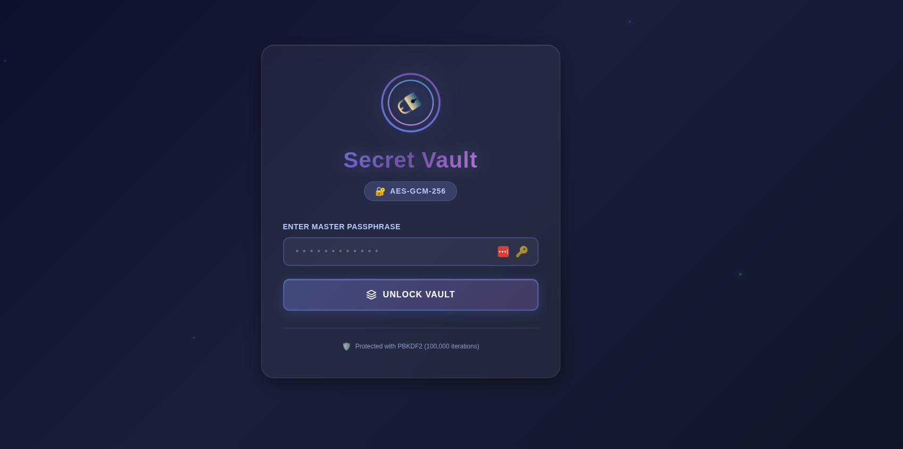
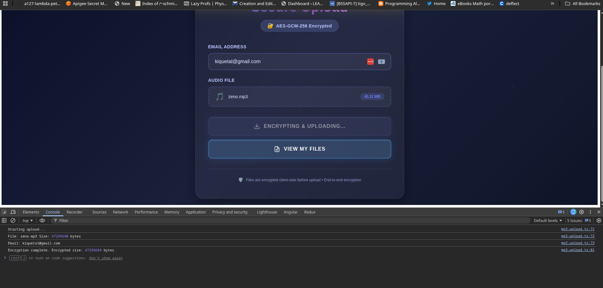
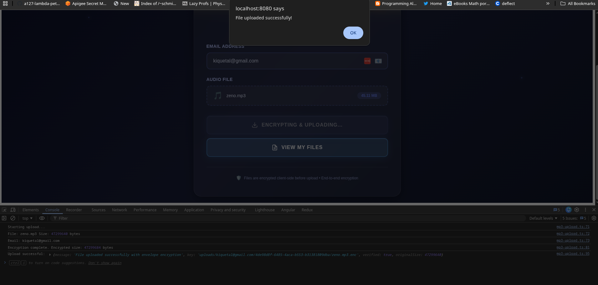
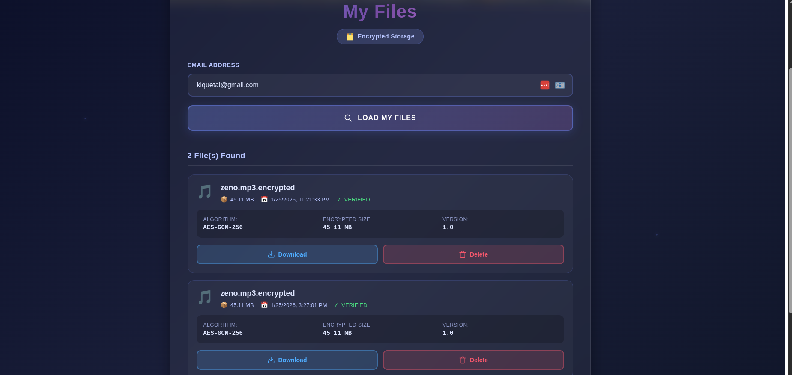
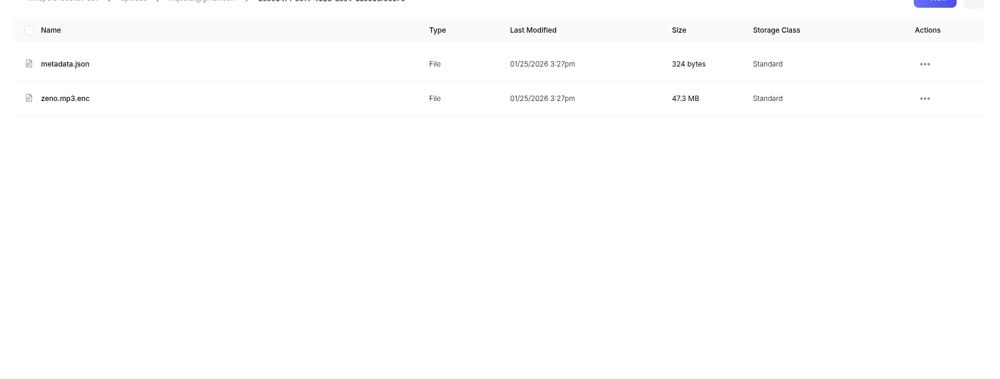

# Quarks-Tigris: Secure File Upload Service

A Quarkus-based secure file upload service with Angular frontend, featuring envelope encryption and S3/Tigris storage.

## Features

✅ **Client-Side Encryption** - Files encrypted in browser with AES-GCM  
✅ **Envelope Encryption** - Server-side re-encryption with random DEK + master key  
✅ **Streaming Processing** - Memory-efficient handling of large files  
✅ **S3/Tigris Storage** - Scalable object storage  
✅ **NATS JetStream** - Event-driven architecture with message streaming  
✅ **Angular Frontend** - Modern SPA with authentication  
✅ **OpenAPI Documentation** - Auto-generated API docs  

## Screenshots

### User Interface Walkthrough

**1. Passphrase Authentication**



Users authenticate with a secure passphrase before accessing the file upload functionality.

**2. File Upload & Encryption**



The application encrypts files client-side before uploading to the server for additional envelope encryption.

**3. Upload Complete**



Successful upload confirmation with file details and verification status.

**4. File List & Management**



View all uploaded files with metadata including original filename, file size, upload timestamp, verification status, and options to download or delete each file.

**5. S3 Storage Structure**



Files are stored in S3/Tigris with organized folder structure: `uploads/{email}/{uuid}/{filename}.enc` plus `metadata.json`

### File Management Operations

The application supports complete file lifecycle management:

- ✅ **Upload**: Client-side encryption → Server-side envelope encryption → S3 storage
- ✅ **List**: View all uploaded files with metadata (size, timestamp, verification status)
- ✅ **Delete**: Remove files with both encrypted data and metadata cleanup
- ✅ **Download**: Decrypt and download original files (via decrypt API)

Each file operation is authenticated and tracked, with comprehensive logging and error handling.

## Quick Start

### Prerequisites
- Java 21+
- Maven 3.9+
- Node.js 20+ (for frontend)
- Docker (optional, for LocalStack/NATS)
- NATS Server with JetStream (for message consumers - F#/.NET/Python/Go)

### Run in Development Mode

**Option 1: With Quarkus DevServices (Automatic)**
```bash
# Start with hot reload (backend + frontend)
# NATS and S3 will be started automatically via DevServices
./mvnw quarkus:dev

# Or use the convenience script
./dev-mode.sh
```

**Option 2: With Docker Compose (Manual)**
```bash
# Start NATS JetStream + LocalStack S3
docker-compose up -d

# Start Quarkus application
export USE_DEVSERVICES=false
export S3_ENDPOINT_URL=http://localhost:4566
./mvnw quarkus:dev
```

**Option 3: Quick Docker Setup**
```bash
# Automated setup script
./setup-docker.sh

# Then start Quarkus
./dev-mode.sh
```

Access the application:
- **Web UI**: http://localhost:8080/whisper
- **API Docs**: http://localhost:8080/whisper/swagger-ui
- **Health Check**: http://localhost:8080/whisper/q/health

NATS JetStream (if using docker-compose):
- **NATS Client**: nats://localhost:4222 (credentials: guest/guest)
- **NATS Monitoring**: http://localhost:8222

### Default Passphrase
```
your-secret-passphrase
```
(Change in `application.properties`)

## Project Structure

```
quarks-tigris/
├── src/main/java/me/cresterida/
│   ├── FileUploadResource.java      # REST endpoints
│   ├── dto/                          # Request/Response DTOs
│   │   ├── ErrorResponse.java
│   │   ├── PassphraseRequest.java
│   │   ├── PassphraseResponse.java
│   │   └── UploadResponse.java
│   ├── model/                        # Data models
│   │   └── EnvelopeMetadata.java
│   ├── service/                      # Business logic
│   │   └── CryptoService.java       # Encryption service
│   └── util/                         # Utilities
│       └── S3StorageService.java    # S3 operations
├── src/main/webui/                  # Angular frontend
│   └── src/app/
│       ├── passphrase/              # Authentication
│       ├── mp3-upload/              # File upload
│       └── auth.guard.ts            # Route protection
└── docs/                            # Additional documentation
    └── archive/                     # Historical docs
```

## Architecture

### System Overview

```ascii
┌──────────────────────────────────────────────────────────────────┐
│                         User's Browser                           │
└──────────────────────────────────────────────────────────────────┘
                               │
                               │ 1. Access Web UI
                               │    http://localhost:8080/whisper
                               ▼
┌──────────────────────────────────────────────────────────────────┐
│                      Angular Frontend (SPA)                      │
│  ┌────────────────┐  ┌────────────────┐  ┌───────────────────┐  │
│  │   Passphrase   │  │   Auth Guard   │  │   MP3 Upload      │  │
│  │   Component    │  │   & Service    │  │   Component       │  │
│  └────────────────┘  └────────────────┘  └───────────────────┘  │
│         │                                          │              │
│         │ 2. Validate Passphrase                  │              │
│         │    (AES-GCM client-side encryption)     │              │
│         └──────────────────┬───────────────────────┘              │
│                            │ 3. Upload Encrypted File             │
└────────────────────────────┼──────────────────────────────────────┘
                             │
                             │ Quinoa Integration
                             ▼
┌──────────────────────────────────────────────────────────────────┐
│                      Quarkus Backend                             │
│  ┌────────────────────────────────────────────────────────────┐  │
│  │              FileUploadResource                            │  │
│  │  • POST /api/validate-passphrase                          │  │
│  │  • POST /api/upload (100MB limit)                         │  │
│  └────────────────────────────────────────────────────────────┘  │
│                            │                                      │
│  ┌────────────────────────────────────────────────────────────┐  │
│  │              CryptoService (service/)                      │  │
│  │  • Verify & decrypt from Angular                          │  │
│  │  • Encrypt with random DEK (streaming)                    │  │
│  │  • Create envelope (encrypt DEK with master key)          │  │
│  └────────────────────────────────────────────────────────────┘  │
│                            │                                      │
│  ┌────────────────────────────────────────────────────────────┐  │
│  │           S3StorageService (util/)                         │  │
│  │  • Generate S3 keys                                        │  │
│  │  • Upload encrypted file                                   │  │
│  │  • Upload envelope metadata                                │  │
│  └────────────────────────────────────────────────────────────┘  │
│                            │                                      │
│                            │ 4. Store Encrypted Data              │
└────────────────────────────┼──────────────────────────────────────┘
                             │
                             │ S3 Client
                             ▼
┌──────────────────────────────────────────────────────────────────┐
│                    S3/Tigris Object Storage                      │
│  • uploads/{email}/{uuid}/file.enc    (encrypted data)          │
│  • uploads/{email}/{uuid}/metadata.json (encrypted DEK)         │
│                                                                  │
│  Dev:  LocalStack (Docker container)                            │
│  Prod: Tigris or AWS S3                                         │
└──────────────────────────────────────────────────────────────────┘
```

### Encryption Flow

```
User Browser
    ↓ (Client encrypts with passphrase: AES-256-GCM + PBKDF2)
Encrypted File → Quarkus Backend
    ↓ (Verify passphrase & decrypt: streaming)
Plaintext Data → CryptoService
    ↓ (Encrypt with random DEK: streaming)
DEK-Encrypted Data
    ↓ (Encrypt DEK with master key: envelope)
S3/Tigris Storage
    ├─ Encrypted File Data
    └─ Metadata (with encrypted DEK)
```

### Security Layers

1. **Client-Side**: AES-256-GCM with PBKDF2 (100k iterations)
2. **Server-Side**: Random DEK per file for data encryption
3. **Envelope**: DEK encrypted with master key for secure storage
4. **Streaming**: Memory-efficient processing (8KB buffers)

## Data Formats

### Envelope Encryption Format

The envelope metadata is stored as JSON in S3 alongside the encrypted file:

**S3 Storage Structure:**
```
uploads/{email}/{uuid}/
├── {filename}.enc          # Encrypted file data (binary)
└── metadata.json           # Envelope metadata (JSON)
```

**Envelope Metadata JSON Schema:**

```json
{
  "version": "1.0",
  "kek": "base64-encoded-encrypted-dek-with-iv-and-tag",
  "algorithm": "AES-GCM-256",
  "original_filename": "audio.mp3",
  "original_size": 1048576,
  "encrypted_size": 1048604,
  "verification_status": "VERIFIED",
  "timestamp": 1706140800000
}
```

**Field Descriptions:**

| Field | Type | Description |
|-------|------|-------------|
| `version` | String | Metadata format version (currently "1.0") |
| `kek` | String (Base64) | The KEK (Key Encryption Key) - contains the DEK encrypted with master key. Format: `[12 bytes IV][encrypted DEK][16 bytes GCM tag]` (base64-encoded) |
| `algorithm` | String | Encryption algorithm used ("AES-GCM-256") |
| `original_filename` | String | Original file name before encryption |
| `original_size` | Long | Original file size in bytes |
| `encrypted_size` | Long | Encrypted file size in bytes (includes IV + GCM tag) |
| `verification_status` | String | Verification status: "VERIFIED" or "NOT_VERIFIED" |
| `timestamp` | Long | Unix timestamp in milliseconds (epoch time) when file was uploaded |

**Encryption Process:**

1. Generate random 256-bit DEK (Data Encryption Key)
2. Encrypt file data with DEK using AES-256-GCM (streaming)
   - Format: `[12 bytes IV][encrypted data][16 bytes GCM tag]`
3. Encrypt DEK with master key using AES-256-GCM to create KEK
   - Format: `[12 bytes IV][encrypted DEK][16 bytes GCM tag]` (stored as base64 in `kek` field)
4. Store encrypted file and metadata separately in S3

**Decryption Process:**

1. Retrieve envelope metadata from S3
2. Decrypt KEK (which is the encrypted DEK) using master key
3. Use decrypted DEK to decrypt file data
4. Return original file

**Important Notes:**
- The `kek` field contains **both** the IV and encrypted DEK in a single base64 string
- The encrypted file contains **its own** IV at the beginning (12 bytes)
- Each encryption operation uses a unique, randomly generated IV
- The DEK is never stored in plaintext - only as encrypted KEK

### NATS JetStream Message Format

After successful file upload, a message is published to the `FILE_UPLOADS` stream on subject `file.uploads`.

**NATS Message JSON Schema:**

```json
{
  "event_id": "4820c1bd-2753-4d70-bcae-43aa36a04889",
  "email": "kiquetal@gmail.com",
  "file_uuid": "8af4a599-089a-431a-833c-0c9a2fca372a",
  "s3_data_key": "uploads/kiquetal@gmail.com/8af4a599-089a-431a-833c-0c9a2fca372a/zeno.mp3.enc",
  "s3_metadata_key": "uploads/kiquetal@gmail.com/8af4a599-089a-431a-833c-0c9a2fca372a/metadata.json",
  "bucket_name": "whispers-bucket-dev",
  "timestamp": 1769394113840
}
```

**Field Descriptions:**

| Field | Type | Description |
|-------|------|-------------|
| `event_id` | String (UUID) | Unique identifier for this upload event |
| `email` | String | Email address of the uploader |
| `file_uuid` | String (UUID) | Unique identifier for the uploaded file |
| `s3_data_key` | String | Full S3 object key for the encrypted file (`.enc`) |
| `s3_metadata_key` | String | Full S3 object key for the envelope metadata JSON |
| `bucket_name` | String | S3 bucket name where files are stored |
| `timestamp` | Long | Unix timestamp in milliseconds (epoch time) |

**NATS Stream Configuration:**

| Setting | Value |
|---------|-------|
| **Stream Name** | `FILE_UPLOADS` |
| **Subject** | `file.uploads` |
| **Storage** | File-based (persistent) |
| **Retention** | 7 days (limits policy) |
| **Max Age** | 168 hours |
| **Replicas** | 1 (default) |

**Consumer Configuration (.NET Client):**

```bash
nats consumer add FILE_UPLOADS file_processor \
  --filter "file.uploads" \
  --ack explicit \
  --pull \
  --deliver all \
  --max-deliver=-1 \
  --max-pending=100 \
  --wait=30s
```

**Message Flow:**

```
File Upload → CryptoService → S3 Storage → NatsService → JetStream
                                                            ↓
                                              .NET Consumer (Pull)
```

**Use Cases for NATS Messages:**

1. **Asynchronous Processing**: Trigger background jobs (transcoding, analysis)
2. **Notifications**: Send email/webhook notifications on upload
3. **Audit Logging**: Track all file upload events
4. **Integration**: Connect to .NET/Python/Go consumers for downstream processing
5. **Monitoring**: Track upload metrics and statistics

**Related Documentation:**
- [NATS_COMMANDS.md](NATS_COMMANDS.md) - NATS CLI commands and consumer setup
- [DOTNET_CONSUMER_SETUP.md](DOTNET_CONSUMER_SETUP.md) - Complete .NET consumer guide with code examples
- [NATS_INTEGRATION.md](docs/NATS_INTEGRATION.md) - NATS integration architecture

### Complete Example: File Upload Flow

**Step 1: User Uploads File**
- File: `my-audio.mp3` (1 MB)
- User: `alice@example.com`
- Client encrypts with passphrase before upload

**Step 2: Server Processes Upload**

Generated UUID: `550e8400-e29b-41d4-a716-446655440000`

S3 Keys created:
```
uploads/alice@example.com/550e8400-e29b-41d4-a716-446655440000/my-audio.mp3.enc
uploads/alice@example.com/550e8400-e29b-41d4-a716-446655440000/metadata.json
```

**Step 3: Envelope Metadata Stored**

`metadata.json`:
```json
{
  "version": "1.0",
  "kek": "a1b2c3d4e5f6g7h8i9j0k1l2kL8vN2mR5tY9wB3xF6jP1qS4uH7zC0eI+GCMTag==",
  "algorithm": "AES-GCM-256",
  "original_filename": "my-audio.mp3",
  "original_size": 1048576,
  "encrypted_size": 1048604,
  "verification_status": "VERIFIED",
  "timestamp": 1737904200000
}
```

**Note**: The `kek` field contains `[12 bytes IV][encrypted DEK][16 bytes GCM tag]` as a single base64 string.

**Step 4: NATS Message Published**

Published to: `FILE_UPLOADS` stream, subject `file.uploads`

```json
{
  "event_id": "550e8400-e29b-41d4-a716-446655440000",
  "email": "alice@example.com",
  "file_uuid": "550e8400-e29b-41d4-a716-446655440000",
  "s3_data_key": "uploads/alice@example.com/550e8400-e29b-41d4-a716-446655440000/my-audio.mp3.enc",
  "s3_metadata_key": "uploads/alice@example.com/550e8400-e29b-41d4-a716-446655440000/metadata.json",
  "bucket_name": "whisper-uploads",
  "timestamp": 1737904200123
}
```

**Step 5: .NET Consumer Processes Message**

Your .NET consumer receives the message and can:
1. Parse the NATS message to get `s3_data_key` and `s3_metadata_key`
2. Download encrypted file from S3: `bucket_name` + `s3_data_key`
3. Download envelope metadata from S3: `bucket_name` + `s3_metadata_key`
4. Decrypt file using the envelope (requires master key)
5. Process the original file (transcoding, analysis, etc.)
6. Acknowledge message to NATS

**Example .NET Code:**

```csharp
var message = JsonSerializer.Deserialize<FileUploadEvent>(msgData);

// Download encrypted file
var encryptedFile = await s3Client.GetObjectAsync(
    message.bucket_name, 
    message.s3_data_key
);

// Download envelope metadata
var metadata = await s3Client.GetObjectAsync(
    message.bucket_name, 
    message.s3_metadata_key
);

// Decrypt and process file...
```

**Security Notes:**
- File is **double-encrypted**: once by client, once by server
- DEK is randomly generated per file (never reused)
- Master key never stored with the data
- Each encryption layer uses unique IVs
- .NET consumer needs master key to decrypt files

## NATS Consumer Integration

The application publishes file upload events to NATS JetStream, enabling asynchronous processing in any language (F#, C#, Python, Go, Node.js, Rust).

For complete setup instructions and code examples, see:
- **[DOTNET_CONSUMER_SETUP.md](DOTNET_CONSUMER_SETUP.md)** - Complete F#/.NET consumer guide with code examples
- **[NATS_COMMANDS.md](NATS_COMMANDS.md)** - NATS CLI commands and consumer setup
- **[NATS_INTEGRATION.md](docs/NATS_INTEGRATION.md)** - Architecture and integration details

## Configuration

### Environment Variables

```bash
# S3/Tigris Configuration
AWS_ACCESS_KEY_ID=your-access-key
AWS_SECRET_ACCESS_KEY=your-secret-key
AWS_REGION=auto
S3_ENDPOINT_URL=https://fly.storage.tigris.dev
S3_BUCKET_NAME=your-bucket-name

# Encryption
APP_PASSPHRASE=your-secret-passphrase
ENCRYPTION_MASTER_KEY=base64-encoded-master-key

# NATS Configuration
QUARKUS_MESSAGING_NATS_CONNECTION_SERVERS=nats://localhost:4222
```

### Generate Master Key

```bash
openssl rand -base64 32
```

## API Endpoints

The application provides a RESTful API for passphrase validation and file upload.

**Interactive API Documentation:**
- **Swagger UI**: http://localhost:8080/whisper/swagger-ui
- **OpenAPI Spec**: http://localhost:8080/whisper/swagger

Use the Swagger UI to explore and test all available endpoints with interactive documentation.

## File Operations

### Upload File

**Endpoint**: `POST /whisper/api/upload`

**Process Flow**:
1. User selects file in Angular frontend (see [passphrase-screen.png](docs/screenshot/passphrase-screen.png))
2. Client-side encryption with AES-256-GCM (see [encrypting-uploading-screen.png](docs/screenshot/encrypting-uploading-screen.png))
3. Upload encrypted file to backend
4. Backend verifies and re-encrypts with random DEK
5. Create envelope metadata with encrypted DEK
6. Store both encrypted file and metadata in S3 (see [s3-files.png](docs/screenshot/s3-files.png))
7. Publish event to NATS JetStream
8. Return success response (see [uploaded-screen.png](docs/screenshot/uploaded-screen.png))

See [API_TESTING.md](API_TESTING.md) for detailed request/response examples and testing instructions.

### List Files

**Endpoint**: `GET /whisper/api/files`

**Headers**: `X-Session-Token: {session-token}`

Lists all files for the authenticated user with metadata including original filename, file ID (UUID), file sizes, verification status, upload timestamp, and encryption algorithm details.

See [API_TESTING.md](API_TESTING.md) for detailed request/response examples and testing instructions.

### Delete File

**Endpoint**: `DELETE /whisper/api/files`

**Headers**: `X-Session-Token: {session-token}`

**Query Parameters**:
- `fileId`: UUID of the file (from list response)
- `fileName`: Original filename (e.g., `audio.mp3`)

Deletes both the encrypted file (`uploads/{email}/{fileId}/{fileName}.enc`) and metadata (`metadata.json`) from S3 storage.

**Important Notes**:
- Frontend sends original filename (e.g., `audio.mp3`)
- Backend automatically handles `.encrypted` and `.enc` extension normalization
- Both encrypted data and metadata are removed for complete cleanup
- Operation requires valid session token
- Deletion is immediate and cannot be undone

**Frontend Integration**: The Angular frontend provides a user-friendly delete button for each file. On successful deletion, the file immediately disappears from the list with no page refresh required.

See [API_TESTING.md](API_TESTING.md) for request/response examples.

## Documentation

### Getting Started
- **[GETTING_STARTED.md](GETTING_STARTED.md)** - Detailed setup guide
- **[API_TESTING.md](API_TESTING.md)** - API testing guide with examples
- **[ENVELOPE_ENCRYPTION_ARCHITECTURE.md](docs/archive/ENVELOPE_ENCRYPTION.md)** - Encryption architecture details

### NATS JetStream Integration (F#/.NET/Python/Go Consumers)
- **[NATS_COMMANDS.md](NATS_COMMANDS.md)** - NATS CLI commands and durable consumer setup
- **[DOTNET_CONSUMER_SETUP.md](DOTNET_CONSUMER_SETUP.md)** - Complete .NET/F# consumer guide with code examples
- **[NATS_INTEGRATION.md](docs/NATS_INTEGRATION.md)** - NATS integration architecture

### Additional Documentation
- **[docs/archive/](docs/archive/)** - Historical documentation

## Development

### Hot Reload
Both backend and frontend support hot reload in dev mode:
- **Backend**: Automatic recompilation on Java changes
- **Frontend**: Automatic rebuild on TypeScript/HTML/CSS changes

### Project Packages

**Backend Packages:**
- `me.cresterida` - REST resources
- `me.cresterida.dto` - Data Transfer Objects
- `me.cresterida.model` - Domain models
- `me.cresterida.service` - Business logic (encryption)
- `me.cresterida.util` - Utilities (S3 storage)

**Frontend Structure:**
- `passphrase/` - Authentication component
- `mp3-upload/` - File upload component
- `auth.guard.ts` - Route protection
- `encryption.service.ts` - Client-side encryption

### Build for Production

```bash
# Build JVM-based JAR
./mvnw package

# Build native executable (requires GraalVM)
./mvnw package -Dnative

# Build container
docker build -f src/main/docker/Dockerfile.jvm -t quarks-tigris .
```


### S3 Connection Issues
Check your endpoint configuration in `application.properties`:
```properties
quarkus.s3.endpoint-override=${S3_ENDPOINT_URL}
quarkus.s3.path-style-access=true
```

### Frontend Build Errors
```bash
cd src/main/webui
npm install
npm run build
```

## Technology Stack

- **Backend**: Quarkus 3.30.7, Java 21
- **Frontend**: Angular 19, TypeScript
- **Storage**: S3-compatible (Tigris, AWS S3, LocalStack)
- **Messaging**: NATS JetStream (message streaming & pub/sub)
- **Encryption**: AES-256-GCM, PBKDF2
- **API Docs**: OpenAPI/Swagger
- **Build**: Maven, npm

## License

Apache 2.0

---

**Built with ❤️ using Quarkus and Angular**

