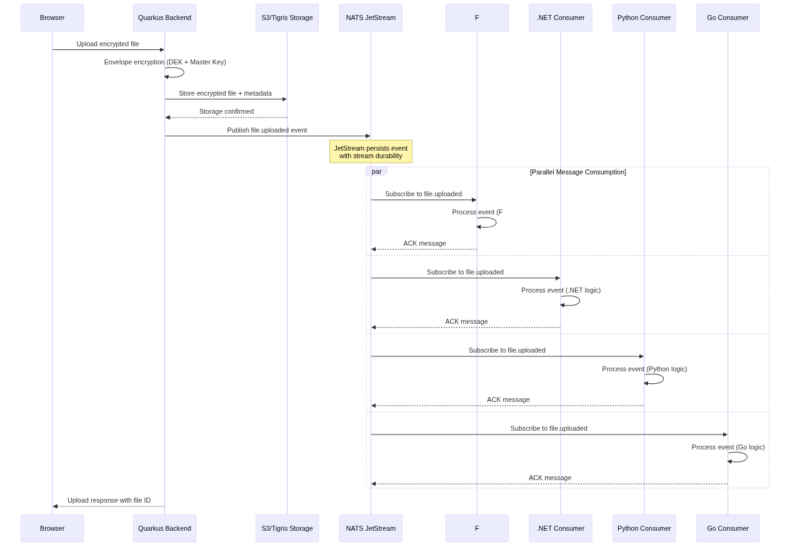

# NATS JetStream Processing Flow

## Overview

This diagram illustrates how NATS JetStream is used in the Quarks-Tigris project for event-driven file processing.

## Architecture Diagram

## Process Flow

### 1. File Upload
- User uploads an encrypted file through the browser
- Quarkus backend receives the file

### 2. Envelope Encryption
- Quarkus applies envelope encryption using:
  - Random Data Encryption Key (DEK)
  - Master Key to encrypt the DEK

### 3. Storage
- Encrypted file and metadata are stored in S3/Tigris
- Storage confirmation is received

### 4. Event Publishing
- Quarkus publishes a `file.uploaded` event to NATS JetStream
- JetStream persists the event with stream durability

### 5. Parallel Message Consumption
Multiple consumers can process the same event simultaneously:
- **F# Consumer**: Subscribes and processes with F# logic
- **.NET Consumer**: Subscribes and processes with .NET logic
- **Python Consumer**: Subscribes and processes with Python logic
- **Go Consumer**: Subscribes and processes with Go logic

Each consumer:
- Receives the event independently
- Processes according to its own business logic
- Acknowledges (ACK) the message back to NATS

### 6. Response
- Quarkus returns upload response with file ID to the browser

## Key Features

### NATS JetStream Benefits
- **Persistence**: Events are stored durably in streams
- **Replay**: Consumers can replay events if needed
- **At-least-once delivery**: Guaranteed message delivery
- **Parallel processing**: Multiple consumers can process the same event
- **Language agnostic**: Consumers can be written in different languages

### Event-Driven Architecture
- Decoupled services
- Scalable processing
- Fault tolerance
- Asynchronous operations

## Consumer Implementation

Each consumer (F#, .NET, Python, Go) can implement different functionality:
- File validation
- Virus scanning
- Thumbnail generation
- Metadata extraction
- Notifications
- Analytics
- Backup operations

## Configuration

NATS JetStream connection details:
- **Client URL**: nats://localhost:4222
- **Credentials**: guest/guest (development)
- **Monitoring**: http://localhost:8222

## Notes

- All consumers operate independently
- Failed consumers don't affect others
- Events can be processed multiple times by different consumers
- JetStream ensures message durability and delivery guarantees
